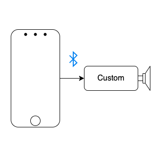
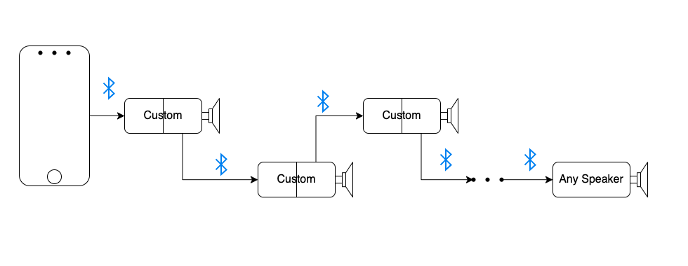
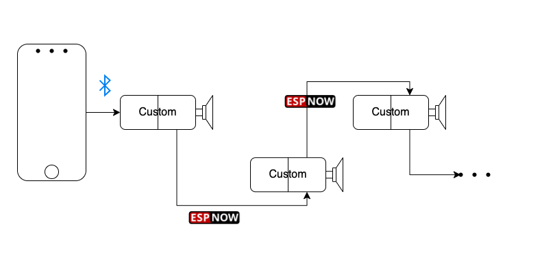
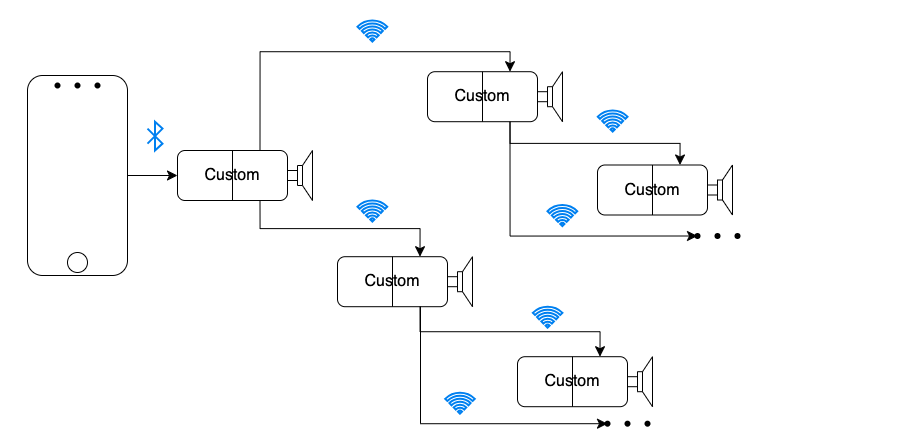

# Speakers
Hardware/software for custom bluetooth speakers and synchronization between multiple brands

Pls ⭐ this repo if you find it helpful

Video demos coming soon...

- [Getting Started](#getting-started)
- [Project Directory](#project-directory)
- [Resources](#resources)
	- [Hardware](#hardware)
	- [Software](#software)
- [References](#references--kudos)

# Getting Started
This project is largly a proof of concept, but it works pretty well enough to make your own at home speaker system

1. Git `git clone https://github.com/BarakBinyamin/speakers.git`
2.  [Buy the parts](#hardware), [Download and setup an Arduino IDE for esp32](#software)
3.  Follow one of the setups in the [src](/src) directory

Have questions? [Make an new Issue](https://github.com/BarakBinyamin/speakers/issues)

# Project Directory
| Name                                   | Purpose                                       | 
| :--                                    | :--                                           |
|[src](/src)                             | Source code & docs                            |

## Implemented Speaker Networks

    Point to Point, Coming soon...

    Bluetooth Daisychain, <a href="src/bluetooth-daisychain">Link</a>

    ESPnow Daisychain,Coming soon...

    ESP Wifi Mesh, Coming soon...

# Resources
## Hardware
- Custom Speaker Parts
	- [Two or more ESP32 dev board's](https://www.ebay.com/sch/i.html?_nkw=esp32+wroom), [Check out the difference between chipsets](https://www.espressif.com/en/products/socs), basically s3's have 2 cores, s2's have 1 core, S2 WROVERS's have extra ram (accessible with extra work) vs S2 WROOM's 
	- [Max98357 i2s DAC Amplifier](https://www.amazon.com/s?k=max98357+i2s+amplifier)
	- [Breadboard's](https://www.amazon.com/s?k=breadboard&crid=3SAWQUGI374BK&sprefix=breadboard+%2Caps%2C331&ref=nb_sb_noss_2)
	- [Breadboard Jumper Wires](https://www.amazon.com/s?k=breadboard+jumper+kit)
	- [Soldering Iron](https://www.amazon.com/s?k=soldering+iron)
	- [Dayton Audio Transducers With Sticky Frame](https://www.amazon.com/s?k=Dayton+Audio+DAEX25+Audio+Exciter+Pair)

## Software
- [Rui & Sarah Santos ESP32 Tutorials](https://randomnerdtutorials.com/getting-started-with-esp32/)
- [Arduino IDE Download](https://www.arduino.cc/en/software)
- [Setting up Arduino IDE for ESP32](https://randomnerdtutorials.com/installing-the-esp32-board-in-arduino-ide-windows-instructions/)
- [Simple ESP32 bluetooth/i2s library by @pschatzmann](https://github.com/pschatzmann/ESP32-A2DP)
- [Advanced Arduino Audio library @pschatzmann](https://github.com/pschatzmann/arduino-audio-tools)
- [Fritzing](https://fritzing.org/) Arduino diagram/pcb tool 
- [Fritzing esp32 board](https://forum.fritzing.org/t/doit-esp32-devkit-v1/6158/8), [DOIT Esp32 DevKit v1 improved.fzpz](https://forum.fritzing.org/uploads/default/original/2X/5/52c6aaad54a039b8412a393cc22f929288fa2ac3.fzpz)

# References & Kudos
- [Professor Yang's](https://www.rit.edu/directory/sjyeec-shanchieh-yang) guidance on data communications
- [Dr. Kwasinski's](https://www.rit.edu/directory/axkeec-andres-kwasinski) unpublished notes data communications
