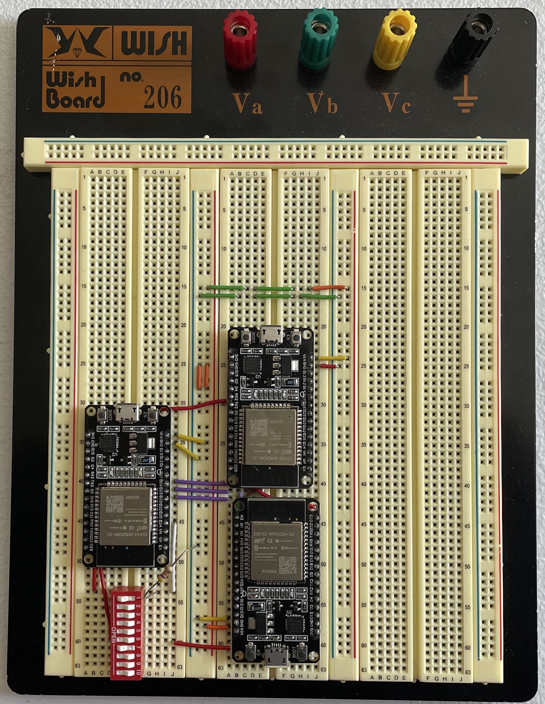
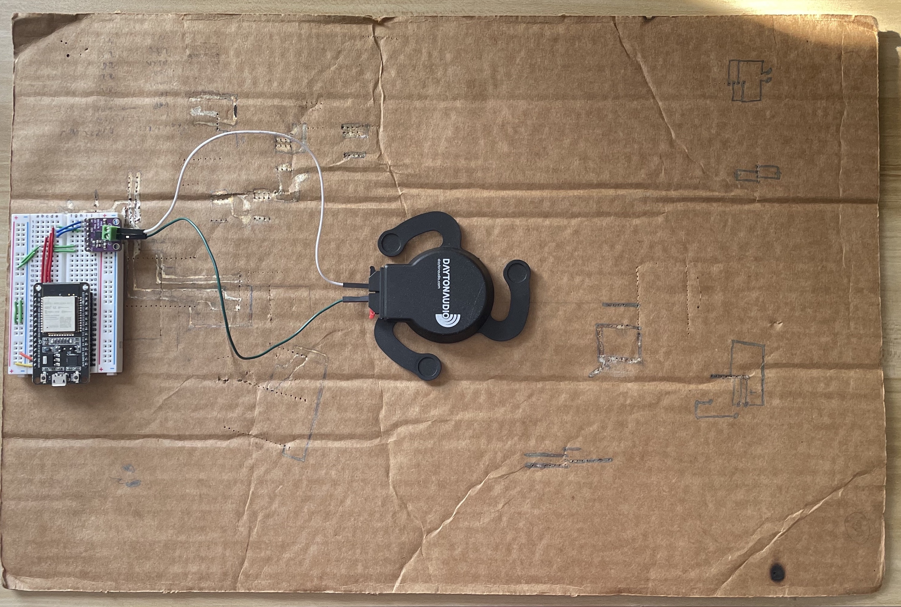
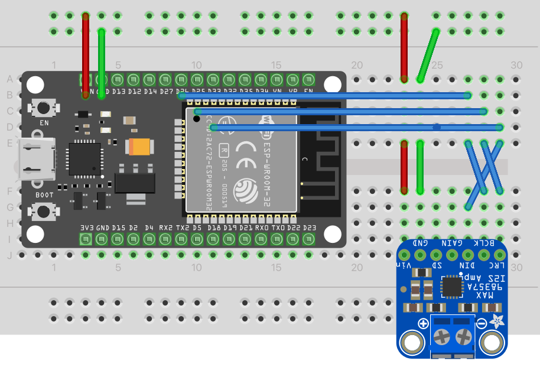
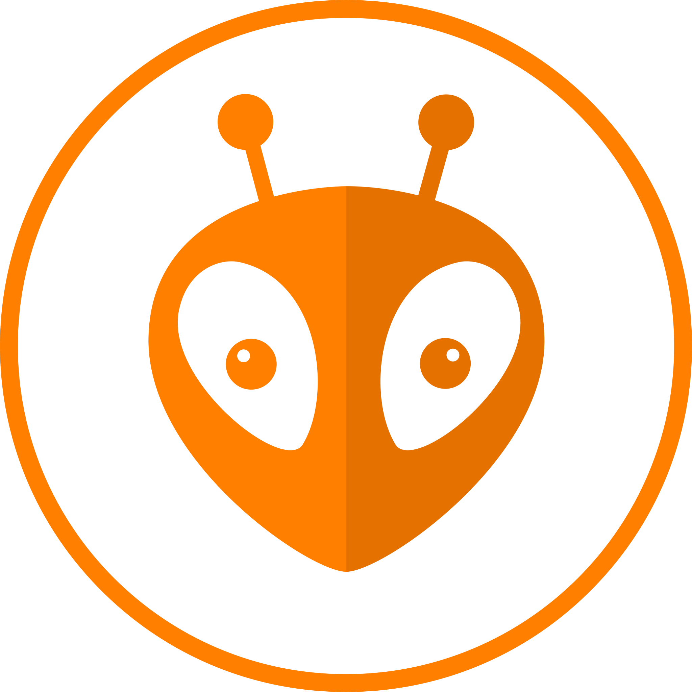

# Speakers
Hardware/software for a bluetooth splitter + iphone app, and custom bluetooth speaker presented at [Imagine RIT 2024](https://www.rit.edu/imagine/exhibits/new-age-speakers)

- [Project Directory](#project-directory)
- [Motivation](#motivation)
- [Getting Started](#getting-started)
- [Resources](#resources)
	- [Hardware](#hardware)
	- [Software](#software)
- [References](#references--kudos)

Have questions? [Feel free to make a new issue](https://github.com/BarakBinyamin/speakers/issues), Also ⭐ this repo!

<video width="100%" src="https://github.com/BarakBinyamin/speakers/assets/50957106/339d98e8-0185-44e8-bbd1-b8f943e875be" controls></video>

## Project Directory
| Name                                   					| Purpose                                             | 
| :--                                    					| :--                                                 |
|[app](app)                             					| Custom app for selecting speakers to connect to     |
|[imgs](imgs)                            					| Images, docs and old source code                    |
|[include](include)                      					| PlatormIO Folder for maunually adding dependencies  |
|[lib](lib)                              					| PlatormIO Folder for maunually adding dependencies  |                    
|[src](src)                               					| Firmware and docs for a bluetooth splitter & speaker|
|[partition-more-pgrm-mem.csv](partition-more-pgrm-mem.csv) | Memory configuration file for esp32                 |
|[platformio.ini](platformio.ini)                           | PlatformIO configuration file                       |

## Motivation
Most common speakers operate off of similar principles. A magnet, a coil, and a cone shaped diaphragm. To get louder and or/higher quality, one can improve these three parts, usually increasing size and complexity at a higher cost. But there has been a recent breakthrough in speaker technology that has not been explored to its new potential. Invented in 1960s, the tactile transducer, also known as a "shaker", has been mostly used in bass speakers, but new innovations by Dayton Audio have increased the frequency range, and decreased the power consumption. This enabling device has started making it's way into high end equipment, but has not yet seen the light of low cost opportunities. 

Distributed Mode Loudspeakers, first developed by NXP in 1960, use this type of exciter combined with a panel to produce distibuted sound rather then directed as with conventional speakers. 

This project aims to reveal how to create low cost high performant speakers by extending techniques and resources discovered by Tech Ingredients, utilizing the ESP32 development platform, Ptchzults bluetooth a2dc library, and an efficiant i2s dac amplifier. 

Cost to produce one speaker: $6/ESP32 + $10/transducer + $5/amplifier + Free cardboard

## Getting Started
1. [Buy the parts](#hardware), [Download and setup an VScode with platformIO](#software)  
2. `git clone https://github.com/BarakBinyamin/speakers.git`

### Speaker
No app is needed if you're just trying to make the speaker
1. Wire up the speaker

2. Open the speakers folder in vscode and Click the PlatformIO >speaker>upload  

3. Connect to "rockz speaker" from your phone and play some music 🎵

### Splitter
In order to build the app you need macOS with Xcode & some other dependencies
1. [Build the splitter](src)
2. [Build the app](app)

## Resources
### Hardware
- [Two or more ESP32 dev board's](https://www.ebay.com/sch/i.html?_nkw=esp32+wroom)
- [Max98357 i2s DAC Amplifier](https://www.amazon.com/s?k=max98357+i2s+amplifier)
- [Breadboard's](https://www.amazon.com/s?k=breadboard&crid=3SAWQUGI374BK&sprefix=breadboard+%2Caps%2C331&ref=nb_sb_noss_2)
- [Breadboard Jumper Wires](https://www.amazon.com/s?k=breadboard+jumper+kit)
- [Soldering Iron](https://www.amazon.com/s?k=soldering+iron)
- [Dayton Audio Transducers With Sticky Frame](https://www.amazon.com/s?k=Dayton+Audio+DAEX25+Audio+Exciter+Pair)

[Check out the difference between chipsets](https://www.espressif.com/en/products/socs), basically s3's have 2 cores, s2's have 1 core, S2 WROVERS's have extra ram (accessible with extra work) vs S2 WROOM's 

### Software
- [Nodejs](https://nodejs.org/en)
- [VScode](https://code.visualstudio.com/)
- [PlatformIO for VScode](https://platformio.org/install/ide?install=vscode), check out [this link](https://randomnerdtutorials.com/esp32-troubleshooting-guide/#COM-port-not-found) if you have issues finding the esp32 when its plugged in

## Some other useful resources
- [Rui & Sarah Santos ESP32 Tutorials](https://randomnerdtutorials.com/getting-started-with-esp32/)
- [Simple ESP32 bluetooth/i2s library by @pschatzmann](https://github.com/pschatzmann/ESP32-A2DP)
- [Fritzing](https://fritzing.org/) Arduino diagram/pcb tool 
- [Fritzing esp32 board](https://forum.fritzing.org/t/doit-esp32-devkit-v1/6158/8), [DOIT Esp32 DevKit v1 improved.fzpz](https://forum.fritzing.org/uploads/default/original/2X/5/52c6aaad54a039b8412a393cc22f929288fa2ac3.fzpz)
- [PlatformIO with multiple main](https://community.platformio.org/t/here-is-a-simple-way-to-have-many-small-main-apps/26009)
- [Converting videos to make them smaller (<10mb) for github](https://superuser.com/questions/714804/converting-video-from-1080p-to-720p-with-smallest-quality-loss-using-ffmpeg)

## References & Kudos
- [Professor Yang's](https://www.rit.edu/directory/sjyeec-shanchieh-yang) guidance on data communications
- [Dr. Kwasinski's](https://www.rit.edu/directory/axkeec-andres-kwasinski) unpublished notes data communications
- [Tech Ingredients](https://www.youtube.com/watch?v=CKIye4RZ-5k&t=2s) Reserach On Speakers Distributed Mode Loudspeakers
