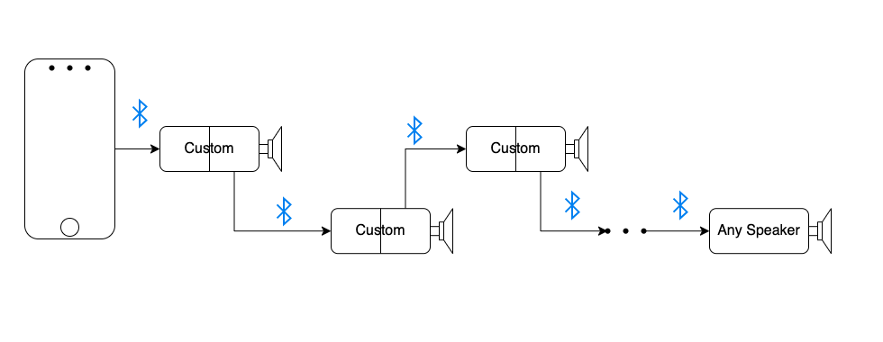
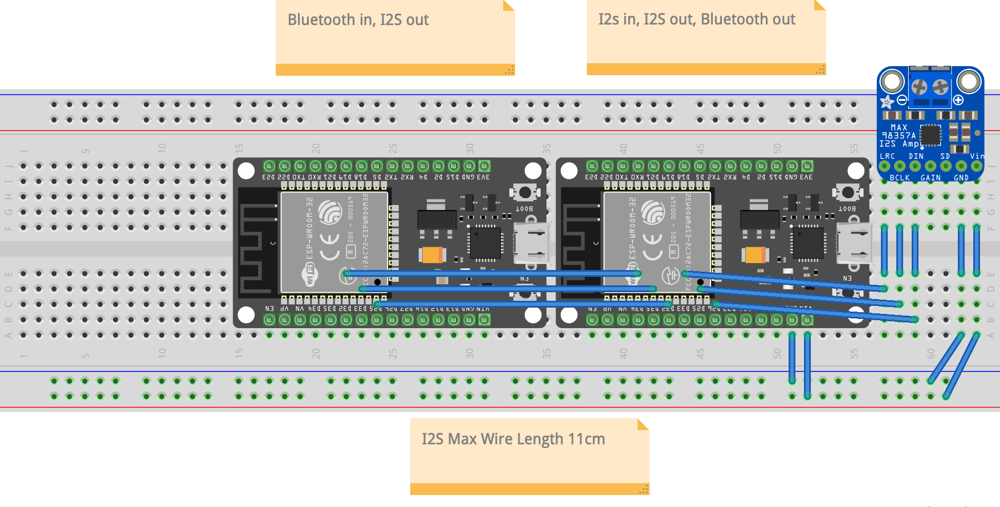

# Bluetooth Daisychain
Connect and synchronize a few custom speakers togeather, and maybe a non custom speaker too

Tested with one custom speaker and one JBL speaker  
**Max Distance** between nodes line of sight: about 12 feet 

    Implementation of many units in daisychain

## Hardware Explained

    One generic unit of the daisychain, the microcontoller on the left is programmed with <a target="_blank" href="bluetooth-daisychain-reciever/bluetooth-daisychain-reciever.ino">bluetooth-daisychain-reciever.ino</a>, the one on the right is programmed with <a target="_blank" href="bluetooth-daisychain-sender/bluetooth-daisychain-sender.ino">bluetooth-daisychain-sender.ino</a>

## Software Explained
Buffering is used to synchronize the speakers

## Features and Bugs
- [ ] Self Healing
- [ ] Max Nodes
- [ ] Max distance
- [ ] Auto update buffer size based on distance, latency, and node number

## Resources